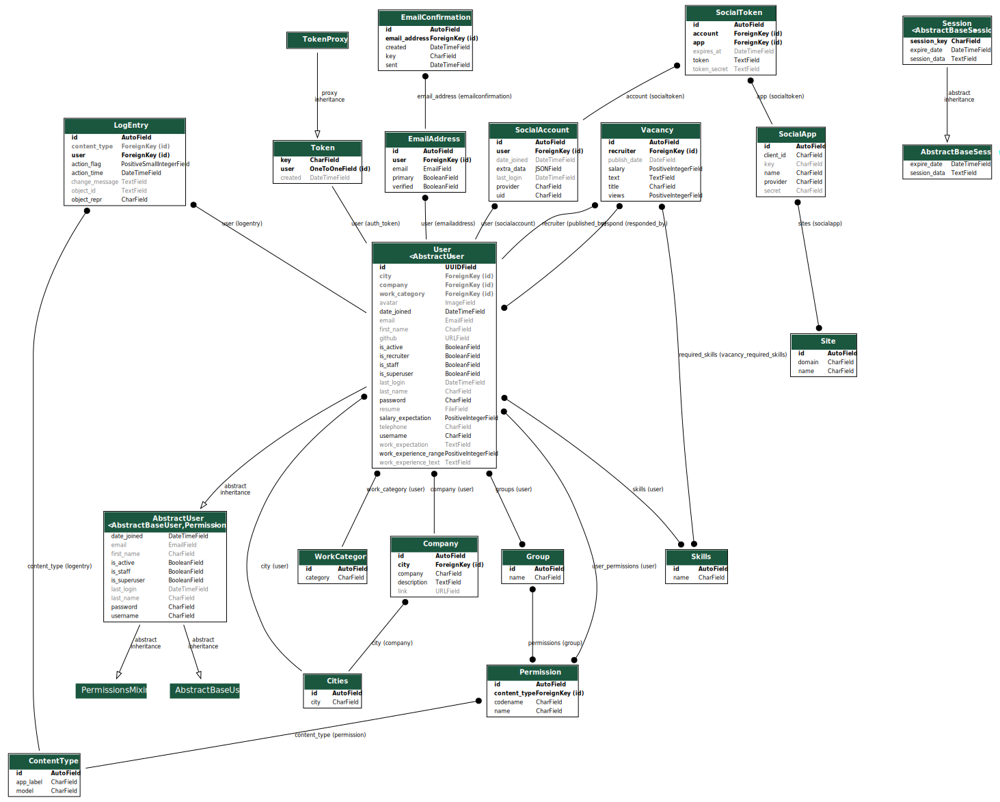

# Лабораторна робота №3
В данному проекті використовуються наступні технології:
- Django
- Django rest framework (for api)
- React
- Redux
- TypeScript
- React Router for routing
- Antd UI framework

Зроблено WebApp для публікацій вакансій. Є 2 типи юзерів: рекрутери та ті, хто шукає роботу. Рекрутери мають змогу робили CRUD операції з вакансіями.
Хотілося б додати, що всі вимоги до л.р. виконані. ТУт мають місце як відношення OneToMany, так і ManyToMany.
Більш того, було зроблене повністю фукціонуюче RESTfull API.
ERD:
